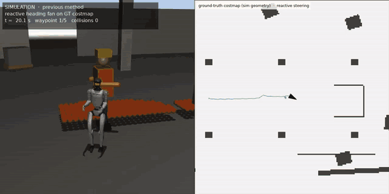

# Humanoid localization & mapping on construction sites

**A Unitree G1 humanoid walks simulated construction and energy sites using only its own sensors: a head-mounted
FMCW LiDAR with per-point Doppler, an IMU and joint encoders. This project measures how well it localizes, how
localization errors become map errors, and how those map errors make the robot stop or fall, and fixes the chain
end to end.**



*Left: chase camera. Right: the robot's own map (LiDAR + Doppler only), tracked people with predicted motion, MPPI
samples and the selected trajectory. First the previous reactive method gets trapped in a U-shaped obstacle, then this
work completes the mission. Full video: [`figures/map_nav_demo.mp4`](figures/map_nav_demo.mp4).*

> **Simulation study.** MuJoCo physics, a pretrained Unitree walking policy (not trained here), simulated sensors.
> Absolute numbers are optimistic; the rankings and failure mechanisms are the point. 

---

## Results in one screen

**Localization** (9 scenes × 3 seeds; ATE in metres, lower is better)

| | building floor | with workers & machines | long corridor | empty roof | open site |
|---|---|---|---|---|---|
| FAST-LIO2 (geometry only) | 0.030 | 0.694 | 0.298 | 5.86 | 0.660 |
| FMCW-LIO with Doppler | 0.030 | 0.035 | 0.147 | 3.25 | 0.039 |
| **+ leg kinematics + Doppler slip gate (this work)** | **0.027** | **0.033** | **0.066** | **0.72** | **0.031** |

- A Doppler-vs-leg-velocity χ² test detects feet slipping on loose sheets with 88–97 % precision and 79–84 % recall.
- Root cause of the 6–8 m drift of geometric LIO on the open site: a 0.4 s "stationary" IMU initialization while the
  humanoid steps in place gives a 1.5° gravity error (½·0.25 m/s²·(8 s)² = 8 m).
- Prior-map localization on a site that changed for a week: 1.3 cm; global relocalization 10/10 (particle filter 7/10).

**Mapping for navigation** (obstacle-map F1 with 0.3 m tolerance against a ground-truth map)

| | building with workers & telehandlers | open site with trucks & workers |
|---|---|---|
| classic stack: FAST-LIO2 pose + raycast clearing | 0.24 | 0.19 |
| perfect pose, no moving-object handling | 0.58 | 0.57 |
| **4D + legs pose, Doppler + guarded raycast (this work)** | **0.98** | **0.93** |

- FMCW Doppler removes walking people and moving vehicles from the map **in the same scan** (point precision 0.93–0.95,
  recall 0.83–0.88). Raycast clearing alone erases thin real structure; temporal persistence fails for people who keep
  crossing the same line.
- Doppler cannot see motion across the beam (radial velocity only), so the online map combines Doppler, guarded raycast
  clearing and a 0.35 s "recent observations" layer: **removing people from the map never removes them from
  collision checking.**

**Navigation** (U-trap, 1 m gap, pallets, people crossing and walking head-on; 5 seeds)

| | success | robot-caused person contacts (5 runs) |
|---|---|---|
| previous: reactive steering on a ground-truth costmap | 1 / 5 | 0 |
| own LiDAR map + MPPI, raycast clearing (classic) | 5 / 5 | 4 (closest 0.12 m) |
| **own LiDAR map + MPPI, Doppler + guarded raycast (this work)** | **5 / 5** | **0** (closest 0.52 m) |

Raycast clearing removes people from the map and, without Doppler, from the robot's awareness; with Doppler they leave
the map but stay tracked and predicted.

**End to end, closed loop on the open site** (the robot walks on its own estimate and its own map):


| open site, 3 seeds | completed | falls | max pose error |
|---|---|---|---|
| geometry-only LiDAR odometry (FMCW-LIO 3D), no moving-object handling | **0 / 3** | 1 | 3.1 m |
| **Doppler + legs, Doppler + guarded raycast map (this work)** | **3 / 3** | 0 | **0.20 m** |

The start-up gravity error turns into a 2–3 m pose error, the map built with that pose has shifted structure and
phantom walls, and the robot stops or falls. On the feature-rich building floor both configurations complete 5 / 5:
the difference appears exactly where sensing is weak.

---

## What is in here

| Path | What |
|---|---|
| `sim/` | MuJoCo scenes (building floor, corridor, roof, open energy site, navigation benchmark), sensor models (FMCW LiDAR with Doppler, IMU, encoders), recorder, closed loop, **online map + MPPI navigator** (`nav.py`) |
| `tools/` | leg odometry, prior-map localizer, loop closure, **map evaluation** (`elevmap.py`), navigation benchmark, plots, ROS 2 bag export / live publishing |
| `fmcw_lio_standalone/` | ROS-free build of FMCW-LIO; our additions (leg velocity update, Doppler slip gate) as **patches** |
| `fast_lio_standalone/` | ROS-free build of FAST-LIO2 (GPL-2.0, see its LICENSE) |
| `figures/` | Key figures and the demo video |

## What was ready-made, what was written

| Ready-made, unmodified | Written in this project |
|---|---|
| Unitree G1 model and **pretrained walking policy** | simulation scenes, terrain, sensor models, recorder, closed loop |
| MuJoCo | ROS-free ports of FMCW-LIO and FAST-LIO2 (I/O only) |
| FMCW-LIO and FAST-LIO2 algorithm cores | leg odometry, leg velocity update + Doppler slip gate (+114 lines in FMCW-LIO) |
| GTSAM, Open3D, gsplat | prior-map localizer, loop-closure front end, online map, Doppler moving-object removal, MPPI navigator, all evaluation |

## Reproduce

```bash
pip install mujoco torch numpy scipy matplotlib open3d gtsam
./scripts/setup_third_party.sh            # clones FMCW-LIO / FAST-LIO / unitree_rl_gym at the pinned commits, applies patches
(cd fmcw_lio_standalone && mkdir -p build && cd build && cmake .. && make -j)
(cd fast_lio_standalone && mkdir -p build && cd build && cmake .. && make -j)

python3 -m sim.record --scene dynamic --out data/dynamic            # record a sequence
python3 tools/run_all.py --scenes dynamic                           # every estimator on it
python3 tools/elevmap.py --scene dynamic                            # maps vs. ground truth
python3 tools/nav_bench.py --scene nav_clutter --seeds 0 1 2 3 4    # navigation benchmark
python3 -m sim.closed_loop --scene outdoor --est 4d_leg --nav mppi --nav-dyn doppler+raycast --out results/x
```
## Future Work
Potensial extensions inclde:
- Visual feature tracking /  visual odometry
- Visual-inertial constrains
- Tightly coupled LİIDAR-visual-kinematic state estimation
- Cam-LIDAR calibration and sync
- etc


## Licenses

Code written in this project: MIT (`LICENSE`). `fast_lio_standalone/` is a derivative of FAST-LIO2 and is GPL-2.0.
FMCW-LIO has no upstream license, so none of its code is included; `fmcw_lio_standalone/patches/` contains only our
changes, applied to a clone of the original repository by `scripts/setup_third_party.sh`.
